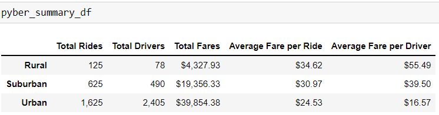
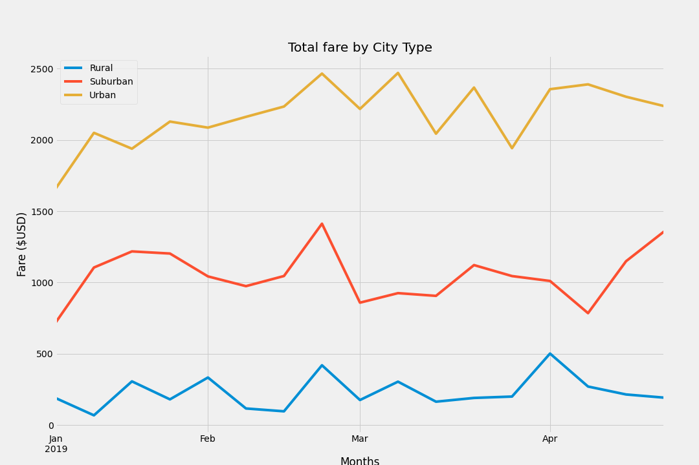

# 05-pyber_analysis
pyber analysis using Jupyter notebook - pandas and matplotlib
## Overview of the analysis:
The purpose of this analysis is to create a visual representation of total weekly fares based on city type for pyber. The EDA shows how the data differs by city type and how those differences can be used by decision-makers at PyBer. We are given the city data and rider data information as csv files. The tools used for this analysis are Jupyter notebook leveraging pandas and matplotlib.

## Results:

The data analysis is performed for the range 2019 -01-01 to 2019-05-08.
The total rides in the urban area is the highest with 1625 rides followed by suburban and rural areas with 625 and 125 respectively.
The urban area has the highest total drivers (2405) followed by suburban (490) and rural (78) areas.
The total fare, follows a similar trend, directly proportional to the total rides, as the total rides in urban areas is more than twice the total rides from suburban and 13 times the  total rides in rural city type.
The average fare per ride   is the highest for rural city type (around $35) , which is  $6 more than urban average fare per ride and around $4 more than suburban average fare per ride.
The average fare per driver   is the highest for rural city type ($55.4) ,almost 3.5 times  urban average fare per driver and 2.5 times suburban average fare per driver.

 
## Summary:

- The data provided for analysis range from Jan 2019 to April 2019.In order to analyze the rides and fare details to make business decisions , a much larger data set covering latest years is required.
- Based on the 4 month data, we see that the number of drivers are comparitively lesser in rural areas. It might be one of the reasons for lesser rides and highest fare in those areas. As mentioned earlier, this has to be confirmed based on a bigger data set. The fare is also dependent on the miles covered and gas price. Additional information including miles per trip and gas price in the rider data would make a greater impact for data analysis.
- All 3 city types have highest total fares during February third week. Urban city types have consistent  peaks and drops from feb 3rd week till April first week. Suburban city shows two big declines  in total fares one in  March and another one in April second week. It is hard to generalize the trend of declines and peaks based on this smaller data set of 4 months.

